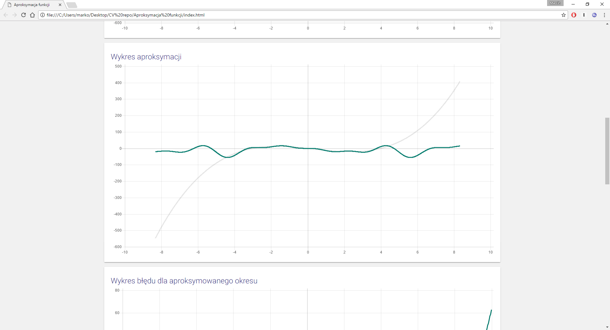

# Aproksymacja-Funkcji
Aproksymacja funkcji poprzez funkcje trygonometryczne. Do projektu posłużono się Chart.js, math.js, materialize oraz noUiSlider.

Całka wykorzystywana w obliczeniach jest obliczana metodą trapezową, przez co wyzualizacje mogą być zakłamane dla bardzo małych wartości funkcji.

